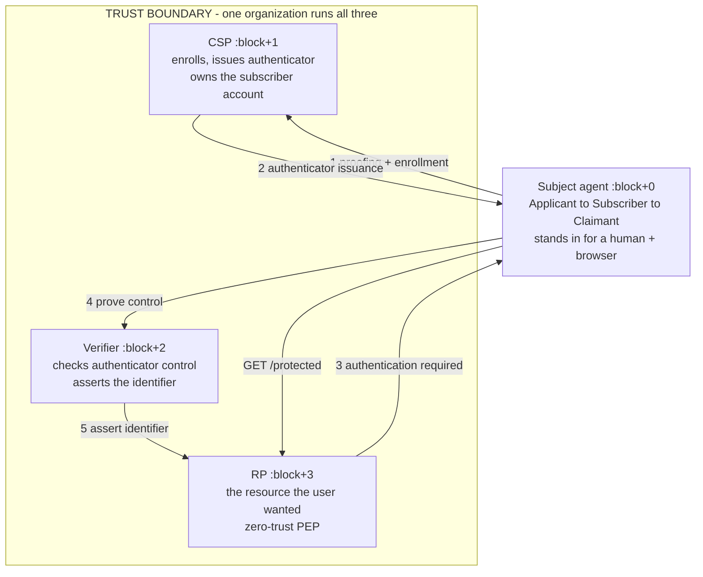
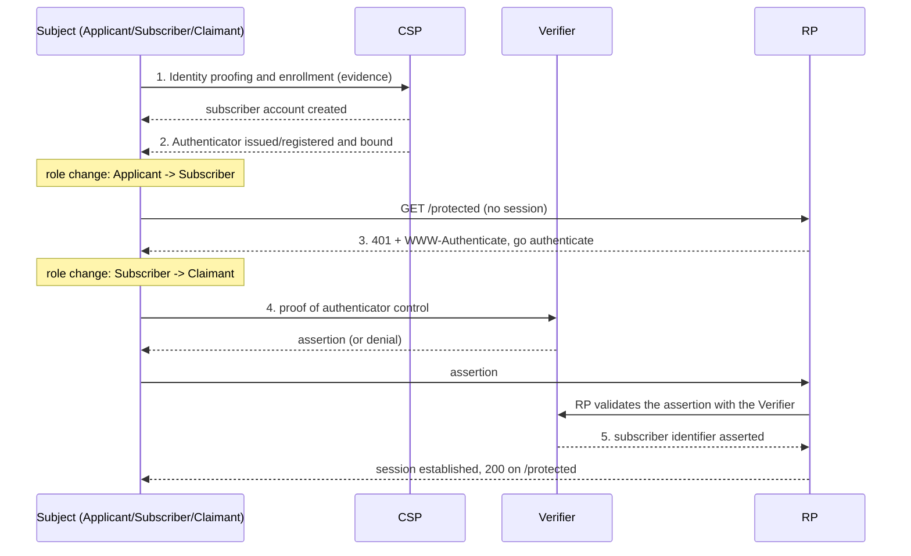
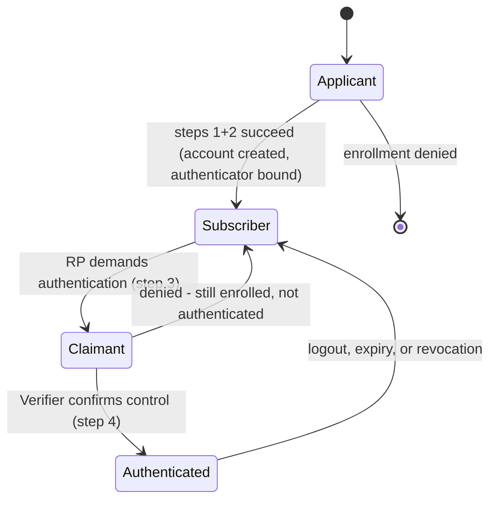
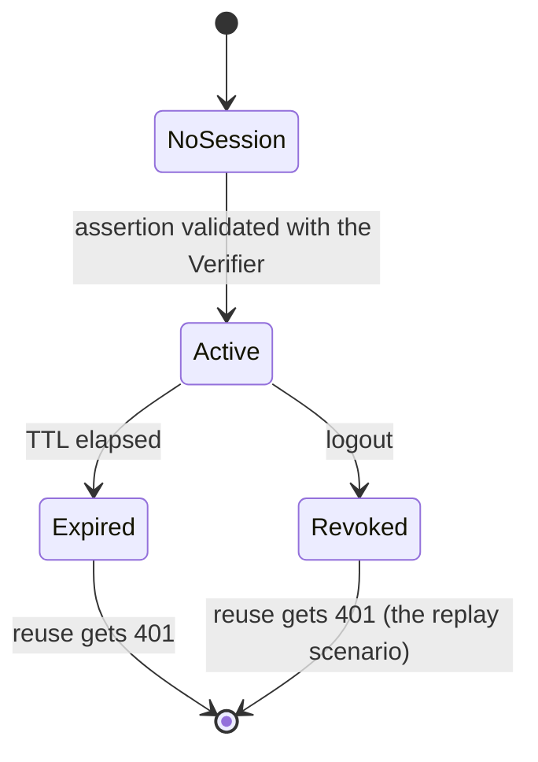
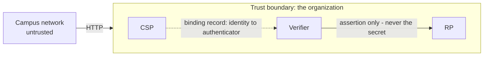
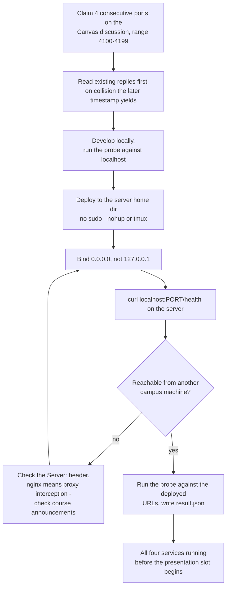
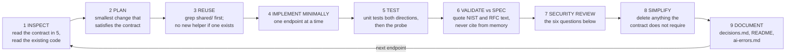
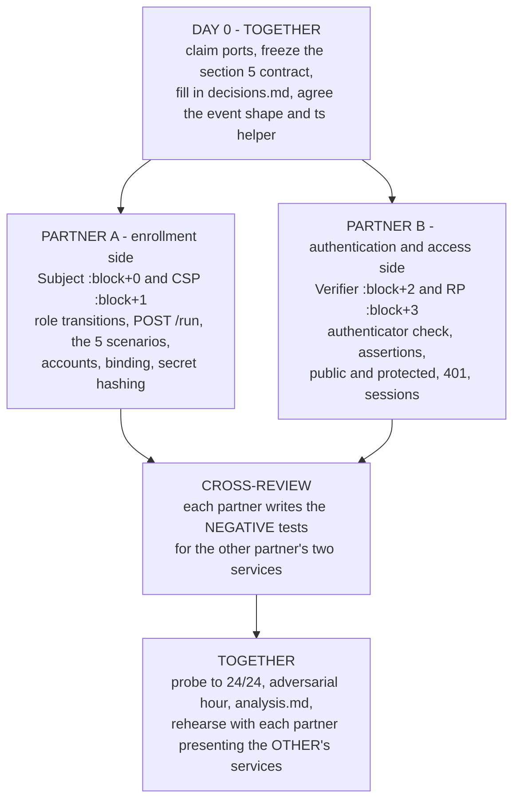

# PROJECT_WORKFLOW.md

Instruction set for an AI coding assistant (and the two humans) building **Lab 1 — the NIST SP 800-63-4 Figure 3 Non-Federated Digital Identity Model**.

Read this file top to bottom before writing any code. Work the sections in order.

---

## 0. Ground rules for the assistant

**Source of truth, in this order:**

1. The lab requirements (ports, contract, scenarios, deliverables)
2. NIST SP 800-63-4 and companion volumes 63A-4 (proofing), 63B-4 (authentication)
3. RFC 9110 (HTTP semantics — `401` + `WWW-Authenticate`)
4. Everything else, including anything this assistant "remembers"

**Tagging convention used throughout this file:**

| Tag | Meaning |
|---|---|
| **[R]** | **Required.** Comes from the lab contract or NIST. Not negotiable, not a design opinion. |
| **[C]** | **Choice.** The team decides, records the decision in §10, and defends it in the presentation. |

**Hard rules:**

- **Do not over-engineer.** A modest system the team can explain beats an elaborate one they cannot.
- **Reuse before you write.** Prefer the standard library and one small web framework already in the project. Before adding a function, grep for an existing one. Before adding a dependency, ask whether the standard library covers it.
- **No OAuth, no OpenID Connect, no SAML.** Those are *federation* technologies. This is the **non-federated** model. Suggesting them is a wrong answer here.
- **No authorization roles.** No admin/viewer, no permission matrix. Authentication only: *can we tell who you are?*
- **Never log an authenticator secret.** Not in transcripts, logs, error messages, URLs, or filenames. There is an automated check for this.
- **Quote or it does not exist.** If you cite a NIST section number, quote the sentence from the actual document. SP 800-63B-3 was withdrawn in August 2025 — old password advice (rotation, composition rules, 8-character minimum) is superseded by Revision 4.
- **Keep a log of assistant errors** in `docs/ai-errors.md`. It is worth credit in the written analysis.

---

## 1. Project goal and architecture

Build a working implementation of **one diagram**: Figure 3 of SP 800-63-4. Four services, five steps, one subject moving through three roles — all inside a single trust boundary (that is what *non-federated* means).

The objective is **understanding, not completeness**. Half the grade is the presentation.



**Why the Subject is a service [R]:** in Figure 3 the Subject is a human. Here it is a program, so the flow is scriptable and the role transitions are *visible in code* — there is a specific line where the agent stops being an Applicant and becomes a Subscriber.

---

## 2. NIST SP 800-63-4 Figure 3 mapping

| Figure 3 element | Our implementation | Port |
|---|---|---|
| Credential Service Provider (CSP) | `services/csp` | claimed block + 1 |
| Verifier | `services/verifier` | claimed block + 2 |
| Relying Party (RP) | `services/rp` | claimed block + 3 |
| Subject (a human in the figure) | `services/subject` — scripted agent | claimed block + 0 |
| Outer rectangle (trust boundary) | One host, one org, no external IdP | — |
| Numbered arrows 1–5 | The five steps in §4, logged to `/transcript` | — |

**Out of scope [R]:** FAL, SP 800-63C-4, federation of any kind. IAL and AAL are *design claims you make and justify in writing*, not features to build.

---

## 3. The four services

| Service | `service` value **[R]** | Owns | Must never |
|---|---|---|---|
| Subject | `subject` | The scripted flow; the three roles | Skip the Verifier in `happy_path` |
| CSP | `csp` | Subscriber accounts, authenticator binding | Make the authentication decision |
| Verifier | `verifier` | Authenticator check, assertion issuance | Serve the protected resource |
| RP | `rp` | Public + protected resource, sessions | **Ever see the authenticator secret [R]** |

That last cell is the architecture's whole point. The `skip_verifier` scenario and the code review both exist to test it.

---

## 4. The five required steps



| # | Step **[R]** | Who talks to whom | Done when |
|---|---|---|---|
| 1 | Identity Proofing and Enrollment | Applicant ↔ CSP | Subscriber account exists |
| 2 | Authenticator Enrollment / Issuance | CSP → Subscriber | Authenticator bound to the account |
| 3 | Authentication Request | RP → Claimant | RP demanded authentication (`401` + `WWW-Authenticate`) |
| 4 | Authentication Process | Claimant ↔ Verifier | Verifier decided success or denied |
| 5 | Authenticated Session | Verifier → RP | RP established a session from the asserted identifier |

All five must occur, in timestamp order, and be provable from the transcripts.

**On `step_name` [C]:** only the step *numbers* 1–5 are fixed by the contract. Use snake_case of the names above (`identity_proofing_and_enrollment`, as in the contract's example) and use the same string in all four services.

---

## 5. HTTP / API contract — the only prescriptive part **[R]**

All four services speak **JSON over HTTP**. Freeze this contract on day 0; both partners then code against it independently.

### 5.1 Every service must expose

| Endpoint | Response |
|---|---|
| `GET /health` | `200` `{"service":"csp","team":"<team>","spec_version":"1.0"}` — `service` is exactly one of `subject`, `csp`, `verifier`, `rp` |
| `GET /transcript` | `200` `{"events":[ ... ]}`, ordered |
| `POST /reset` | `200` or `204`; clears state so the flow can run again |

Transcript event shape:

```json
{"seq": 1,
 "run_id": "probe-happy_path-8f3a1c",
 "step": 1,
 "step_name": "identity_proofing_and_enrollment",
 "actor": "applicant",
 "peer": "csp",
 "outcome": "success",
 "ts": "2026-09-14T18:22:03.114Z",
 "detail": "evidence accepted"}
```

- `step` is 1–5 · `actor` is one of `applicant`, `subscriber`, `claimant`, `csp`, `verifier`, `rp` · `outcome` is `success` or `denied`
- **`ts` must be ISO 8601 with sub-second precision.** Whole-second timestamps collide and the cross-service ordering check fails for a reason that teaches you nothing. Write one shared UTC helper and use it everywhere.
- **Never put an authenticator secret in `detail` or any other field.**

### 5.2 The Relying Party must also expose

| Endpoint | Response |
|---|---|
| `GET /` | `200` with **no credential of any kind** — the public resource |
| `GET /protected` | `401` **carrying a `WWW-Authenticate` header** (RFC 9110 §15.5.2) when no valid session credential is presented; `200` with the protected content when a valid session is presented |

The `WWW-Authenticate` header is the most commonly forgotten requirement in the whole lab. Narrate RFC 9110 §15.5.2 out loud when you show the 401 in the demo.

### 5.3 The Subject agent must also expose

`POST /run` — drives the entire flow end to end:

```json
// request
{"run_id":"probe-happy_path-8f3a1c","scenario":"happy_path","canary":"CANARY-a1b2c3"}
// response
{"run_id":"probe-happy_path-8f3a1c","scenario":"happy_path",
 "outcome":"success","detail":"protected resource returned HTTP 200"}
```

- `outcome` is `success` or `denied`.
- Tag **every** transcript event in **all four** services with the `run_id` you were given, so a grader can isolate one run.
- **The `canary` is the string to use as the authenticator secret.** The harness then searches your transcripts for it. If it turns up, you logged a secret.

---

## 6. State and identity-role transitions



**[R]** These three roles are *positions in the identity lifecycle*, not authorization roles. Make each transition a single, named, obvious line in the Subject agent — you will be asked to point at it.

RP session lifecycle:



---

## 7. Security requirements and trust boundaries

**[R] Required — graded by the probe and by the code review:**

1. **Role separation.** CSP, Verifier, and RP are separate processes with separate state. No service reaches into another's store.
2. **The RP never sees the authenticator secret.** Only the Verifier does.
3. **Verification is real.** There must be no path by which the RP concludes "authenticated" without the Verifier having actually checked an authenticator. This is the `skip_verifier` test.
4. **Secrets at rest** are salted and hashed with a *password hashing function* (scrypt, argon2, or pbkdf2 — the standard library has one) — never a bare SHA-256 or MD5.
5. **Quiet denials.** Failure must not reveal whether the account existed: same status, same body, for a wrong secret and an unknown identifier.
6. **Honest errors.** No stack traces, file paths, or SQL in any response.
7. **Session credentials** come from a cryptographic random source (`secrets`, `os.urandom`, `crypto.randomBytes`), expire, and can be revoked.
8. **Input validation** on every identifier and body before use; no injection path into the data store.
9. **No KBA.** SP 800-63B-4 prohibits knowledge-based authentication ("what was your first pet").
10. **No secrets in the repo or the zip.** Ship `.env.example` with placeholders. A committed private key is an automatic deduction.

**Trust boundaries to draw and defend:**



- **Subject ↔ everything:** fully untrusted input, always.
- **CSP → Verifier:** the Verifier trusts the CSP's binding record. Compromise the CSP and you mint identities.
- **Verifier → RP:** the RP trusts *only* assertions it can attribute to your Verifier. This is the load-bearing edge of the whole design.
- **RP is a Policy Enforcement Point** in SP 800-207 terms; the Verifier supplies the decision.

**[C] Choices to make and record in §10:** what identity proofing means here (self-asserted? invite code? out-of-band enrollment token? simulated document check?) and which IAL you are modeling; what the authenticator is (SP 800-63B-4 §3.1 catalogs the types — if you pick passwords, read §3.1.1.2 first, because Revision 4 changed the rules and the 15-character minimum for single-factor passwords will surprise you); how the assertion travels from Verifier to RP; how sessions end; what the protected resource is; how the first administrator comes to exist.

> **Recommended minimal default [C]:** an **opaque, single-use assertion handle** that the RP introspects by calling the Verifier. It makes `skip_verifier` impossible by construction, has no cryptography to get wrong, and is explainable in four minutes. A signed JWT is equally defensible — but then key management, `alg` confusion, and expiry are yours to handle and to defend.

---

## 8. Required test scenarios

### 8.1 Happy path **[R]**

`happy_path` → `success`: all five steps, in timestamp order, the Applicant → Subscriber → Claimant progression visible in the transcripts, and `/protected` returning `200`.

### 8.2 Negative scenarios **[R]** — `POST /run` must support all four

| Scenario | What it does | Required outcome |
|---|---|---|
| `wrong_authenticator` | Claimant presents the wrong authenticator output | `denied`, **no successful step 5** |
| `unenrolled_claimant` | A claimant who was never enrolled tries to authenticate | `denied`, no successful step 5 |
| `replay` | A session credential is reused after logout or expiry | `denied` on reuse |
| `skip_verifier` | Subject presents itself directly to the RP, no Verifier involved | `denied`, no successful step 5 |

`skip_verifier` is the one that matters: will your RP accept a claim about identity that no Verifier ever checked? Many real systems fail exactly this.

### 8.3 Unit tests **[R] — one command, never touches the live store**

Write in both directions.

- **Does it work?** Enrollment creates a subscriber. A correct authenticator output verifies. A valid assertion produces a session.
- **Does it refuse?** (the half people skip) Wrong output rejected *without revealing whether the account existed* · expired session credential rejected (**inject the clock or mint something already expired — never `sleep()` in a test**) · tampered assertion rejected · assertion the RP cannot attribute to your Verifier rejected · duplicate identifier rejected · malformed request rejected · your rate limiting actually engages.

**[R] Each denial test carries one comment sentence naming the attack it defends against.** If you cannot name the attack, you may not need the test — or you may not yet understand it.

### 8.4 Adversarial hour **[R] before the presentation**

With `curl`: a made-up token at `/protected` · call the Verifier directly with an identifier you were never issued · call the CSP's binding endpoint for somebody else's account · enroll twice with the same identity · use a valid session credential from a different client. Bring the most interesting result — working or not — to the presentation.

### 8.5 The conformance probe

```bash
python3 conformance_probe.py --config team.json --verbose
```

```bash
python3 conformance_probe.py --config team.json --json result.json
```

24 checks in five groups: `S-*` structure (5) · `P-*` public access and denial (4) · `H-*` happy path and ordering (7) · `N-*` refusals (4) · `X-*` hygiene (3). Standard-library Python; run it **early and often**. It is a conformance check, not a security assessment — 24/24 means your system does what Figure 3 says, not that it is safe.

---

## 9. Deployment workflow



**[R] Rules:** bind only to the ports your team claimed · no sudo, everything runs from your home directory · never probe another team's ports · campus VPN from off campus · nginx may answer on your port before your service does, so budget time for it.

Probe config (`team.json`):

```json
{"team":"ada-grace",
 "endpoints":{
   "subject":"http://daily-server.research.colostate.edu:4112",
   "csp":"http://daily-server.research.colostate.edu:4113",
   "verifier":"http://daily-server.research.colostate.edu:4114",
   "rp":"http://daily-server.research.colostate.edu:4115"}}
```

---

## 10. Repository structure and configuration

```
lab1-<teamname>/
├── README.md              # [R] service URLs+ports, how to run each from a clean checkout,
│                          #     the single test command, one paragraph on who built what
├── PROJECT_WORKFLOW.md    # this file
├── .env.example           # [R] placeholders only
├── .gitignore             # [R] .env, *.db, *.sqlite*, *.pem, venv/, node_modules/
├── team.json              # probe config
├── result.json            # [R] probe output from the DEPLOYED system
├── conformance_probe.py   # given; do not modify
├── services/
│   ├── subject/           # Partner A
│   ├── csp/               # Partner A
│   ├── verifier/          # Partner B
│   └── rp/                # Partner B
├── shared/                # [C] ONE place for: transcript writer, ISO-8601 timestamp helper,
│                          #     HTTP client, config loader. Reuse these; do not re-implement
│                          #     them per service.
├── tests/                 # [R] runs from one command, never touches the live store
└── docs/
    ├── analysis.md        # [R] the 2-3 page written analysis
    ├── decisions.md       # [C] the design-choice register below
    └── ai-errors.md       # where the assistant was wrong
```

**Decision register — fill this in before writing code [C]:**

| Decision | Ours | Why | Anchor |
|---|---|---|---|
| Language / framework / data store | | | runs without sudo |
| What proofing means here; IAL modeled | | | SP 800-63A-4 |
| Authenticator type | | | SP 800-63B-4 §3.1 |
| How the assertion travels to the RP | | | SP 800-63B-4 |
| How sessions end (expiry / logout / revocation) | | | |
| What the protected resource is | | | plausible reason to protect it |
| How the first administrator comes to exist | | | the bootstrap problem |

---

## 11. Definition of done

- [ ] Ports claimed on the discussion board; four services live on exactly those ports, reachable from campus
- [ ] `/health`, `/transcript`, `/reset` on all four; `/` and `/protected` on the RP; `POST /run` on the Subject
- [ ] The `401` on `/protected` carries `WWW-Authenticate`
- [ ] All five steps appear in the transcripts, ordered, with sub-second timestamps and the correct `run_id`
- [ ] Applicant → Subscriber → Claimant progression visible in the transcripts
- [ ] All five scenarios behave as specified; each of the four negatives is `denied` with no successful step 5
- [ ] The canary never appears in any transcript; no secret-bearing field names
- [ ] Unit tests pass from a single command, with a denial test per attack, each carrying its one-sentence comment
- [ ] Adversarial hour done; the most interesting finding written down
- [ ] `result.json` produced by a probe run against the **deployed** system
- [ ] `lab1-<teamname>.zip` under 25 MB — no venv, node_modules, database files, or secrets
- [ ] `README.md` complete; `docs/analysis.md` covers the diagram mapped to Figure 3, the §10 decisions, **two of the five steps an attacker defeats without breaking any cryptography**, the weakest point named plainly, and where the AI misled you
- [ ] Presentation rehearsed: 4 min architecture, 7 min live run plus two denials, 6 min chosen topic, 3 min Q&A — and **both partners can explain all four services**

---

## 12. AI development workflow

Run this loop **once per service**, and again per scenario. Never jump straight to implement.



**Stage 7 — the six review questions. Run these on your own repository before submitting:**

1. **Separation of roles.** Are CSP, Verifier, and RP genuinely separate, or does one reach into another's data? Does the RP ever see or handle the authenticator secret? It must not.
2. **Verification is real.** Trace the path by which the RP decides a subject is authenticated. Can that decision be reached without the Verifier having actually checked an authenticator? Quote the exact lines that make the decision.
3. **Secret handling.** Salted and hashed with a password hashing function? Do secrets appear in logs, transcripts, error messages, URLs, or committed files?
4. **Denial behavior.** Does a failure reveal whether the account existed? Is it a `401` with `WWW-Authenticate`? Do errors leak stack traces, paths, or SQL?
5. **Input validation.** Are identifiers and bodies validated before use? Any injection path into the store?
6. **Session credentials.** Cryptographic random source? Do they expire? Can they be revoked?

For each, output: **Verdict** (PASS / CONCERN / FAIL) + **Evidence** (file and line, code quoted) + one sentence. Cite file and line for every claim; say "no evidence found" rather than inferring; do not speculate about code you were not shown.

**Then judge the review itself.** Automated reviews over-report on questions 4 and 5 (flagging deliberate design choices as flaws) and under-report on question 2, the one that matters most, because it requires actually tracing control flow. Write one paragraph on where the review was wrong — it is strong material for the chosen-topic segment.

**Use the assistant as an adversary, not just an author:** paste the enrollment handler and ask for the cheapest *social-engineering* attack against the process it implements · have it role-play an attacker who knows a subscriber's identifier but holds none of their authenticators · ask what compromising the CSP versus the Verifier versus the RP each buys, and which is hardest to detect · ask it to design an account-recovery flow, then ask it to break the flow it just designed.

---

## 13. Splitting the work between two people

**[R] Each partner owns at least two running services, and both must be able to explain all four.**



| | Partner A | Partner B |
|---|---|---|
| Services | Subject, CSP | Verifier, RP |
| Owns | Role transitions, `POST /run`, the five scenarios, enrollment policy, secret storage | Authenticator verification, assertion issue and validate, `WWW-Authenticate`, session lifecycle |
| Writes negative tests for | Verifier, RP | Subject, CSP |
| Rehearses by presenting | Verifier + RP | Subject + CSP |
| Presents live (4-min architecture) | Steps 1–2 | Steps 3–5 |

**Single-owner files, to avoid merge conflicts:** `shared/` (design the interface together, one person types it) · `README.md` (A) · `docs/analysis.md` (B drafts, A edits) · `result.json` (whoever ran the probe last).

**Integration rule:** §5 is frozen on day 0 and both partners code against it. If the contract must change, it changes *in this file first*, then in code.

---

## 14. Claude skills to use before starting

| When | Skill | Why |
|---|---|---|
| Before anything else | `anthropic-skills:pdf` | Extract and **quote** SP 800-63-4 Figure 3 and the relevant 63A-4 / 63B-4 sections. This is the guard against invented section numbers — the failure mode the lab explicitly warns about. |
| Day 0 | `/init` | Generate `CLAUDE.md` so every later session inherits the contract, the port block, and the "no OAuth, no authorization roles" rules. |
| Day 0, optional | `/fewer-permission-prompts` | Allowlist the read-only commands you will run hundreds of times (`curl`, `python3 conformance_probe.py`). |
| While building | `/run` | Launch the four services and confirm a change works in the real system, not just in tests. |
| Every loop, stage 7 | `/security-review` | Security pass over the pending changes; pair it with the six questions in §12. |
| Every loop, stage 7 | `/code-review` | Correctness and reuse review of the diff. Use `high` whenever you touch the Verifier → RP path. |
| Every loop, stage 8 | `/simplify` | Reuse and simplification pass. This is the antidote to over-engineering. |
| Deliverables | `anthropic-skills:docx` | Produce the 2–3 page written analysis as a Word file if one is wanted. |
| Deliverables | `anthropic-skills:pptx` | Build the 20-minute deck in the 4 / 7 / 6 / 3 segments. |
| Deliverables | `artifact-diagramming` | Draw the "what we actually built, mapped to Figure 3" diagram cleanly. |

**Not needed here:** chart and dataviz skills (there is no data to chart), scheduling and loop skills (no recurring job), canvas-design.

---

## Quick start for the assistant

1. Read §5 (contract) and §7 (security) in full.
2. Check that the decision register in §10 is filled in. If it is not, ask the humans — do not guess the proofing model or the authenticator type.
3. Scaffold `shared/` first: transcript writer, sub-second ISO-8601 timestamp helper, HTTP client, config loader.
4. Build in this order: `/health` on all four → RP `/` and `/protected` 401 → CSP enroll and bind → Verifier check and assert → RP session → Subject `POST /run` happy path → the four negative scenarios.
5. Run the probe after every one of those.
6. Then §12 stages 7–9. Then check §11.
